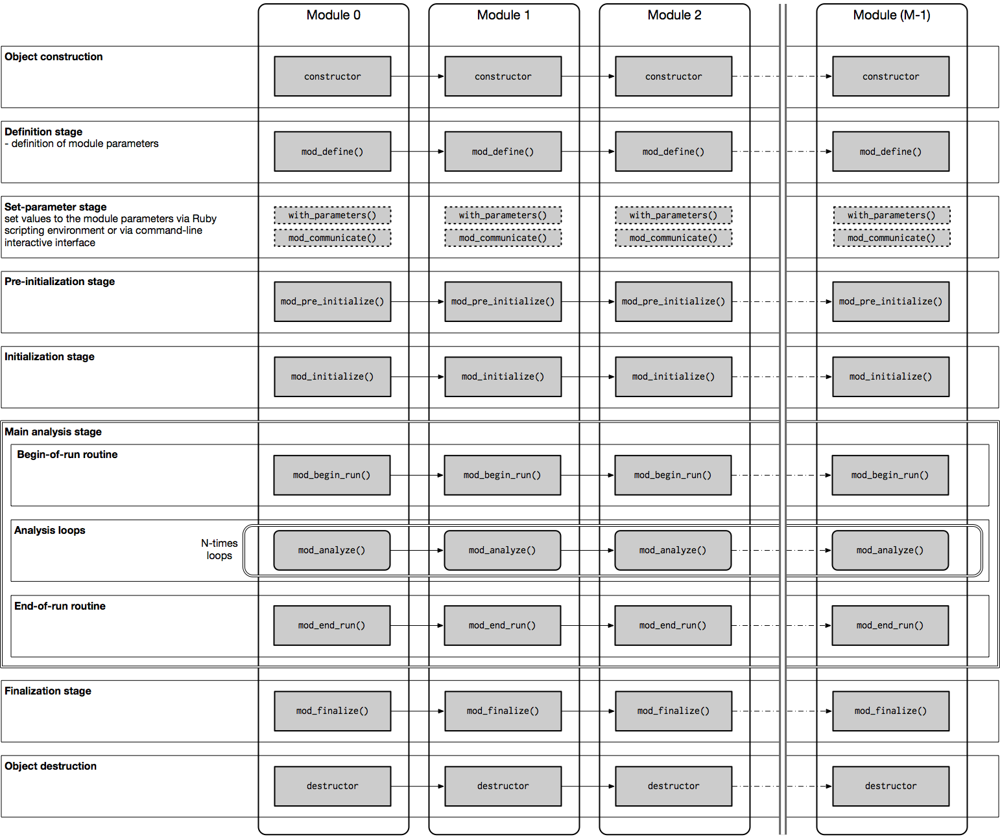

ANL Next
========================================

- Version: 2.2.0
- Author: Hirokazu Odaka

## Table of Contents

- [News](#news)
- [Introduction](#introduction)
- [ANL Model](#anl-model)
- [Installation](#installation)
- [Getting Started](#getting-started)
- [Frequently Asked Questions](#frequently-asked-questions)

News
----------------------------------------

### Version 2.0

**released on August 28, 2017**

- **multi-thread mode (parallel computing)**
- new interactive mode (beginner friendly)
- more flexible Ruby scripting environment
- clearer messages
- API reviewed and changed

This is the first major update of ANL Next. It supports multi-thread mode,
in which event loops are executed in parallel. API has been reviewed and
some of them are changed. A migration tool (a Ruby script to convert a
source tree for version 2.0) is provided (please ask the author). You can
stay at version 1; we recommend using the latest stable release 1.8.5.

To use multi-thread mode, please find
[examples/histogram_mt](./examples/histogram_mt)
and
[examples/mt_testing](./examples/mt_testing).

Introduction
----------------------------------------

ANL Next is a framework for building a modular data analysis application
or a modular data analysis framework (this means a framework for building
a framework). What is a modular analysis framework? It consists of
multiple modules, each of which is responsible for a single task, and
then, you can combine them by making a chain of these modules to build a
more complicated application. This application performs analysis loops
through the module chain (see [ANL Model](#anl-model)). This design
allows you to develop a big complicated program by simply chaining much
simpler modules. You can easily concentrate on a simple task while you are
writing a single module.

This concept is best fitted to an event-by-event analysis. The
event-by-event analysis is defined as data analysis that treats a list of
event entries, where an event can be a generation of a some data or input
of a some data element, and applies some processes to each event entry.
Since an algorithm for each event entry must be identical for all events,
the entire program can be realized as loops of procedure that applies
the algorithm to all the entries. We often need such a data processing
since a variety of data analysis can be decomposed into

1. generation or input of an event, which is described as some data
2. processing this event entry by some algorithms, and
3. iterations of 1 and 2 for all events.

ANL Next provides us with a useful framework to do this.

In high-energy astrophysics, for example, experimental data obtained with
X-ray or gamma-ray telescopes (i.e., radiation detectors) perfectly
follows this scheme. A detection of a photon makes an event. This event
should be processed by some data reduction algorithms. Iterations over a
number of events result in final products that have scientific meaning.

Important factors in successful data analysis are being quick and being
correct. To be quick, software should run fast and operations of software
should be flexible. ANL Next employs a modern software design to meet
these requirements. All ANL modules and the data analysis manager in this
framework are written in C++ (c++11), which is one of the fastest
programming language, and has an excellent static type system to ensure
correctness. To build an analysis program, which is described by a chain
of modules, and to execute it, you can use a Ruby scripting environment,
receiving comfortable flexibility by dynamic nature of Ruby. Ruby is a
widely used powerful scripting language that supports fully
object-oriented programming and functional programming, and easy to use
and learn like Python.

### History

The modular analysis concept has been well established since we began to
use computers for data analysis. The original ANL was a data analysis
framework developed by the PEP-4 TPC collaboration at the Lawrence
Berkeley Laboratory in 1980s. It has been improved on data sharing methods
between ANL modules in 1990s by T. Takahashi, H. Kubo, Y. Ishisaki,
et al., and employed for pipeline data processing of X-ray detectors
onboard the ASCA and Suzaku X-ray satellite observatories. Then, the ANL++
framework was developed by Shin Watanabe for data reduction of hard X-ray
and gamma-ray detectors, re-implemented in C++. ANL++ has been also used
for simulations of the radiation detectors and of astrophysics.

ANL Next is a completely redesigned framework, keeping the ANL modular
analysis concept of the event-by-event loops. Since software technology
has been very much improved, we have re-written the code completely from
scratch based on a modern software design. The framework exploits C++ for
its speed and robustness and Ruby for its quickness and flexibility. This
project began as a part of PhD project by Hirokazu Odaka who studied
astrophysical Monte-Carlo simulations.


### Contact

- Hirokazu Odaka
- KIPAC, Stanford University
- hodaka(AT)stanford.edu

### GitHub

https://github.com/odakahirokazu/ANLNext/

### Platforms

- Mac (the author's main environment for development and testing)
- Linux

#### Test environment (Mac)

- iMac Pro (2017)
- macOS Catalina (10.15.5)
- Apple clang version 11.0.3 (clang-1103.0.32.62)
- CMake 3.17.3
- ruby 2.7.1p83
- ROOT 6.10/04
- SWIG 4.0.2
- Boost 1.72.0

### API Reference

http://web.stanford.edu/~hodaka/anlnext/doxygen/

### Applications using ANL Next

- ComptonSoft (simulation and data analysis suite for X-ray/gamma-ray detectors)
- MONACO (astrophysical Monte-Carlo radiative transfer simulations)
- HXISGDDataReceiver (online data acquisition system of HXI/SGD onboard the ASTRO-H satellite, used at a ground facility)

### License

ANL Next is distributed under the GNU General Public License version 3.


ANL Model
----------------------------------------

(now writing..., figure to be updated)



Installation
----------------------------------------

### Required Software

#### (1) C++ compiler
*conformation to C++14 required*

#### (2) [Boost C++ library](http://www.boost.org/)
*version 1.80.0 or later.*

#### (3) [CMake](http://www.cmake.org/)
*version 3.20 or later.*

This software uses CMake (Cross platform make) for easy installation.  

#### (4) [Ruby](http://www.ruby-lang.org/en/)
*version 2.7, 3.2 or later.*

ANL Next provides a Ruby extended library, which is generated by SWIG, as
interface to operate an analysis software generated by this framework.
Ruby is a scriptable, dynamic, object-oriented programming language, and
offers powerful and flexible interface to control the user program. Ruby
is widely used in the world, and is easy to learn like Python.

#### (5) [SWIG](http://www.swig.org/)
*version 4.1.1 or later.*

As SWIG (Simplified Wrapper and Interface Generator) provides an easy way
to generate extended libraries of various scripting languages, ANL Next
uses SWIG for making Ruby binding of itself.

#### (6) [GNU Readline](http://cnswww.cns.cwru.edu/php/chet/readline/rltop.html)
*replaceable with another readline-compatible library
(e.g., one distributed with OS X)*

Readline is necessary for interactive mode and user-input in the main
analysis loop. You may disable this library if you do not need useful
user interactive functions.

### Installation Guide

#### (1) Obtain ANL Next

    $ git clone https://github.com/odakahirokazu/ANLNext.git

#### (2) Perform CMake

Make a directory for building the software, and then move to the
directory.

    $ cd ANLNext
    $ mkdir build
    $ cd build

Perform cmake to generate Makefiles. Give the directory of the source
tree to `cmake` command.

    $ cmake .. [options] -DCMAKE_INSTALL_PREFIX=/path/to/install

**For most users, default settings (described below) should work.
So just execute:**

    $ cmake ..

By default, the install destination is set to `${HOME}`.
So `make install` will
install headers and libraries into the user's home directory, such as
`${HOME}/include` or `${HOME}/lib`. You can change it by setting
`CMAKE_INSTALL_PREFIX`.

There are several options:

- `ANLNEXT_ENABLE_INTERACTIVE_MODE` (Default=ON): enable an interactive mode
- `ANLNEXT_USE_READLINE` (Default=ON): enable Readlibe library
- `ANLNEXT_USE_RUBY` (Default=ON): enable Ruby extention library
- `ANLNEXT_USE_TVECTOR` (Default=OFF): enable ROOT vector.
- `ANLNEXT_USE_HEPVECTOR` (Default=OFF): enable CLHEP vector.
- `ANLNEXT_USE_G4VECTOR` (Default=OFF): enable Geant4-CLHEP vector.
- `ANLNEXT_INSTALL_HEADERS` (Default=ON): install all header files.
- `ANLNEXT_INSTALL_CMAKE_FILES` (Default=ON): install all cmake files.

#### (3) Make and install

    $ make -jN (N: number of parallel compilation processes)
    $ make install

#### (4) Set environment variables

If you installed ANL Next into the $HOME directory (default destination),
you need to set the following environment variables:  
(example for bash/zsh)

    export RUBYLIB=${HOME}/lib/ruby:${RUBYLIB}

Otherwise, you need to set the following environment variables:

    export ANLNEXT_INSTALL=/path/to/install
    export RUBYLIB=${ANLNEXT_INSTALL}/lib/ruby:${RUBYLIB}

In addition, Mac users before El Capitan may need to set:

    export DYLD_LIBRARY_PATH=${ANLNEXT_INSTALL}/lib:${DYLD_LIBRARY_PATH}

Or Linux users may need this:

    export LD_LIBRARY_PATH=${ANLNEXT_INSTALL}/lib:${LD_LIBRARY_PATH}


Getting Started
----------------------------------------

By using this framework, you can easily construct your own applications.
If you want a new application containing only existing modules, you can
quickly start with writing a Ruby script that defines an **analysis
chain** describing an order of the ANL modules and sets parameters to be
passed to the modules. This environment provides you with powerful and
flexible scripting framework.

### How to write a Ruby script operating an ANL application

You can see the simplest example of ANL application in
[examples/simple_loop](./examples/simple_loop). This application performs
a simple loop in which nothing happens. To build it, you can use cmake:

    $ cd examples/simple_loop
    $ mkdir build
    $ cd build
    $ cmake ../source -DCMAKE_INSTALL_PREFIX=/path/to/install
    $ make
    $ make install

To run this application, see
[run/run_simple_loop.rb](./examples/simple_loop/run/run_simple_loop.rb).
To use the extension library, it is necessary to *require* ANL libraries.

```ruby
require 'anlnext' # ANL Next library
require 'myPackage' # Ruby extension library using ANL Next
```

At the beginning, you need to define your own application class which
should be derived from *ANL::ANLApp* class. Then, you can define the
analysis chain in *setup()* method. In this method, you specify the order
of ANL modules in the analysis chain, and set parameters of the modules.
To push a module to the analysis chain, you can use *ANLApp#chain()* method.
Just after *chain()*, you can set parameters by using *with_parameters()*.

```ruby
# Define your own application class derived from ANL::ANLApp.
class MyApp < ANL::ANLApp
  # Define an analysis chain in setup() method.
  def setup()
    chain MyPackage::MyModule
    with_parameters(my_parameter1: 10,
                    my_parameter2: 20.5,
                    my_parameter3: "Hello",
                    my_vector1: [1, 2, 3, 4, 5],
                    my_vector2: [1.3, 4.0, 11.2, 3.2],
                    my_vector3: ["Hakuba", "Niseko", "Appi"])

### continue...
```

*chain()* method takes two parameters: module class and module ID. If
module ID is not specified, the class name is used for the module ID.
The module ID should be unique in a single analysis chain. If you need to
add a module of the same type, it is necessary to set another unique
module ID via the second argument.

```ruby
### continue...
    # If you need to add the same type of module, you should set another name
    # via the second argument.
    chain MyPackage::MyModule, :MyModule2
    with_parameters(my_parameter2: 102.1,
                    my_vector3: ["Jupiter", "Venus", "Mars", "Saturn"])

    chain MyPackage::MyModule, :MyModule3
    with_parameters(my_parameter11: -301,
                    my_parameter12: 1000000000,
                    my_parameter13: 9876543210)
### continue...
```

After setting the parameter, just instantiate an object of the application
and run. The number of the analysis loop should be passed through the
first argument. The second argument is optional for setting the display
frequency.

```ruby
app = MyApp.new
app.run(100000)
```

If you want to perform an infinite loop, set -1 as the loop number.
The second argument is the display frequency (optional).

```ruby
app.run(-1, 100000)
```

After the run, you will get the below message. From this message, you
find the definition of the analysis chain and module parameters, which
are shown before the main analysis stage. After the analysis stage
finishes, you get information on the status of the analysis chain.

```
$ ./run_simple_loop.rb

######################################################
#                                                    #
#          ANL Next Data Analysis Framework          #
#                                                    #
#    version:  2.00.00                               #
#    author: Hirokazu Odaka                          #
#    URL: https://github.com/odakahirokazu/ANLNext   #
#                                                    #
######################################################


        **************************************
        ****          Definition          ****
        **************************************


ANLManager: starting <define> routine.


ANLManager: <define> routine successfully done.


        **************************************
        ****      Pre-Initialization      ****
        **************************************


ANLManager: starting <pre_initialize> routine.


ANLManager: <pre_initialize> routine successfully done.


        **************************************
        ****        Initialization        ****
        **************************************


        **************************************
        ****        Analysis chain        ****
        **************************************

   #        Module ID                                   Version    ON/OFF 
----------------------------------------------------------------------------
   0    MyModule                                          1.0        ON      
   1    MyVectorModule                                    1.0        ON      
   2    MyMapModule                                       1.0        ON      
   3    MyModule2 (MyModule)                              1.0        ON      
   4    MyModule3 (MyModule)                              1.0        ON      


        **************************************
        ****      Module parameters       ****
        **************************************

--- MyModule ---
my_parameter1: 10
my_parameter2: 20.5
my_parameter3: Hello
my_vector1: 1 2 3 4 5 
my_vector2: 1.3 4 11.2 3.2 
my_vector3: Hakuba Niseko Appi 
my_parameter11: 200
my_parameter12: 20000
my_parameter13: 5000000000
my_parameter21: 1

--- MyVectorModule ---
my_vector: 
  index: 0
    ID: 1
    type: strip
    x: 0
    y: 0
  index: 1
    ID: 3
    type: pixel
    x: -0.2
    y: 4
  index: 2
    ID: 4
    type: pixel
    x: -0.2
    y: 6


--- MyMapModule ---
my_map: 
  name: CdTe1
    ID: 3
    type: pixel
    x: -0.2
    y: 4
  name: CdTe2
    ID: 4
    type: pixel
    x: -0.2
    y: 6
  name: Si1
    ID: 1
    type: strip
    x: 0
    y: 0
  name: Si2
    ID: 2
    type: strip
    x: 0
    y: 2


--- MyModule2 ---
my_parameter1: 1
my_parameter2: 102.1
my_parameter3: test
my_vector1: 
my_vector2: 
my_vector3: Jupiter Venus Mars Saturn 
my_parameter11: 200
my_parameter12: 20000
my_parameter13: 5000000000
my_parameter21: 1

--- MyModule3 ---
my_parameter1: 1
my_parameter2: 2
my_parameter3: test
my_vector1: 
my_vector2: 
my_vector3: 
my_parameter11: -301
my_parameter12: 1000000000
my_parameter13: 9876543210
my_parameter21: 1


ANLManager: starting <initialize> routine.


ANLManager: <initialize> routine successfully done.


<Begin Analysis> | Time: 2017-07-20 16:40:39 -0700

        **************************************
        ****        Main Analysis         ****
        **************************************

Number of events: 1000000


ANLManager: starting <begin_run> routine.


ANLManager: <begin_run> routine successfully done.


ANLManager: starting analysis loop (with user-console mode on).
----------------------------------------------------------------------------
  input '.q' => quit the analysis loop
  input '.i' => show the current event index
  input '.s' => show the status of event selections (of the master thread)
----------------------------------------------------------------------------

Event :          0
Event :     100000
Event :     200000
Event :     300000
Event :     400000
Event :     500000
Event :     600000
Event :     700000
Event :     800000
Event :     900000

ANLManager: analysis loop successfully done.


ANLManager: starting <end_run> routine.


ANLManager: <end_run> routine successfully done.


        **************************************
        ****        Analysis chain        ****
        **************************************
               Put: 1000000
                |
    [   0]  MyModule  version  1.0                  
       1000000  |  OK:    1000000 | Skip:          0 | Error:          0
    [   1]  MyVectorModule  version  1.0            
       1000000  |  OK:    1000000 | Skip:          0 | Error:          0
    [   2]  MyMapModule  version  1.0               
       1000000  |  OK:    1000000 | Skip:          0 | Error:          0
    [   3]  MyModule/MyModule2  version  1.0        
       1000000  |  OK:    1000000 | Skip:          0 | Error:          0
    [   4]  MyModule/MyModule3  version  1.0        
       1000000  |  OK:    1000000 | Skip:          0 | Error:          0
               Get: 1000000


        **************************************
        ****  Result of Event Selections  ****
        **************************************

  Number of EVS : 0
------------------------------------------------------------------------------
                 key                        |     counts     |   completed    
------------------------------------------------------------------------------
------------------------------------------------------------------------------


<End Analysis>   | Time: 2017-07-20 16:40:40 -0700

        **************************************
        ****         Finalization         ****
        **************************************


ANLManager: starting <finalize> routine.


ANLManager: <finalize> routine successfully done.


```

### A more practical example

You can find a more practical example in
[examples/histogram](./examples/histogram). Below is a Ruby script
to run this application. It has three ANL modules: *SaveData*,
*GenerateEvents*, and *FillHistogram*. *SaveData* is a utility module to
save analysis products to a ROOT file. It does nothing in the main analysis
stage. *GenerateEvents* generates an event data that have a property of
energy by a some quick "simulation" based on a random number.
*FillHistogram* gets generated event information and then makes histograms
of the energy of the events. This example is a minimal application that
has a practical function, telling us how an ANL application works.

```ruby
#!/usr/bin/env ruby

require 'anlnext'
require 'testHistogram'

class MyApp < ANL::ANLApp
  def setup()
    chain TestHistogram::SaveData
    with_parameters(filename: "output.root")

    chain TestHistogram::GenerateEvents
    with_parameters(energy: 120.0,
                    detector1_sigma: 1.0,
                    detector2_sigma: 5.0)

    chain TestHistogram::FillHistogram
    with_parameters(nbin: 128,
                    energy_min: 80.0,
                    energy_max: 150.0)
  end
end

a = MyApp.new
a.run(1000000)
```

You will get a ROOT file "output.root" which has energy spectra
generated by this simulation.


Development of Your Applications
----------------------------------------

If you want to develop analysis software which applies your original
algorithm, you need to develop a new ANL module. You can find a simple
example of your own ANL application in *examples* directory.

### Design

### ANL Module

#### Structure of ANL module

#### Methods defined in an ANL module

- `mod_define()`
- `mod_pre_initialize()`
- `mod_initialize()`
- `mod_begin_run()`
- `mod_analyze()`
- `mod_end_run()`
- `mod_finalize()`

#### Definition of parameters

### Data Sharing between ANL Modules
    
#### Event selection flag (EVS)

#### Accessing information in other modules

You can access other modules via get_module() method.

```c++
// Declaration of a const pointer to a module you want to access.
const YourModule* module;

// Get a pointer to the module you request, giving the module ID
// and the address of the pointer.
get_module("YourModule", &module);

// Get information via a member method of the module.
// The member method must be declared as const.
double someProperty = module->getSomeProperty();
```

#### Action to other modules without "const"

If you want to do an action to another module, you need to get
*non-const* pointer to the module. You can use
get_module_NC() in this case.
NC stands for non-const.

```c++
// Declaration of a pointer to a module you want to access.
YourModule* module;

// Get a pointer to the module you request, giving the module ID
// and the address of the pointer.
get_module_NC("YourModule", &module);

// Call methods of the module to make some actions.
module->setSomeProperty(property);
module->doSomething();
```
    
#### Ruby binding

#### Build settting

#### Run


Frequently Asked Questions
----------------------------------------

### Differences from ANL/ANL++

#### How can I use BNK?


****************************************
